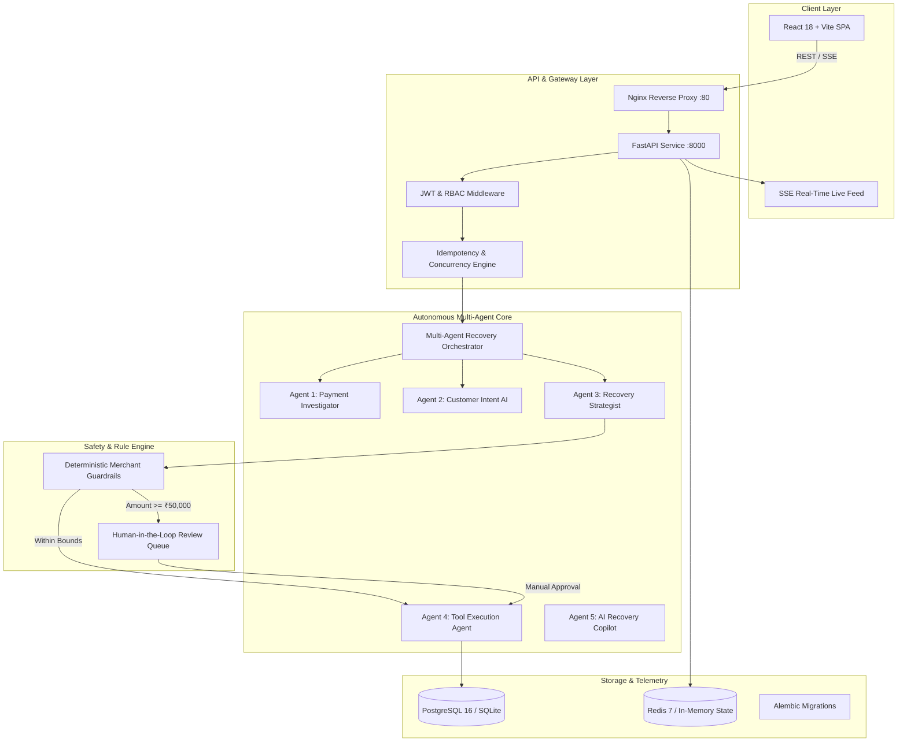

# PayRecover AI — Autonomous Multi-Agent Revenue Recovery Platform

> **Production-Grade AI Revenue Recovery Copilot for Indian Fintech Ecosystems**  
> Intercepting payment failures across UPI, Cards, Net Banking, and recurring e-mandates with deterministic merchant guardrails, multi-agent intelligence, and real-time operations.

[](https://github.com)
[-blue?style=flat-square&logo=vite)](https://github.com)
[](https://fastapi.tiangolo.com)
[](https://react.dev)
[](https://www.postgresql.org)
[](https://redis.io)
[](https://alembic.sqlalchemy.org)

---

## 1. Executive Summary & Problem

In India's digital payments ecosystem, online merchants lose **10% to 25% of top-line revenue** to preventable drop-offs:
- **UPI PSP App Latency & Timeouts**: Transient MPIN bank network drops.
- **Card 3DS Failures & OTP Abandonment**: Customer hesitation or bank OTP delivery delays.
- **Insufficient Account Balances**: Customers requiring scheduled pay-later reminders.
- **RBI Recurring E-Mandate Expiry**: Subscription mandates failing silently at issuing banks.
- **Cart Abandonment**: High-intent shoppers dropping off at final checkout.

Traditional recovery systems either blindly spam customers with disconnected emails or do nothing. **PayRecover AI** is an autonomous multi-agent platform that investigates payment failures in sub-second time, scores recovery probability, understands customer intent, applies strict merchant guardrails, and executes frictionless recovery actions (such as generating 1-click Razorpay UPI links) over WhatsApp, SMS, and Email.

---

## 2. Core Architecture



---

## 3. Technology Stack

| Layer | Technologies |
| :--- | :--- |
| **Frontend** | React 18, TypeScript, Tailwind CSS, Recharts, Lucide React, Vite |
| **Backend** | Python 3.11+, FastAPI, SQLAlchemy, Pydantic v2, Alembic |
| **Database** | PostgreSQL 16 (production) with automatic SQLite zero-config fallback |
| **State & Cache** | Redis 7 (production) with automatic resilient in-memory fallback |
| **AI & Telemetry** | Google Gemini API with deterministic fallback, structured output contracts, agent trace logger |
| **Security** | Stateless JWT (HMAC-SHA256), Bcrypt hashing, 4-tier RBAC, Idempotency keys |
| **Containerization** | Docker, Docker Compose, Multi-stage Nginx + Alpine builds |

---

## 4. Key Platform Features

1. **Command Center Cockpit**: Real-time visibility into revenue processed, active recovery rate, revenue-at-risk, and live Server-Sent Events (SSE) feed.
2. **Deterministic Merchant Guardrails**: Configurable safety gates:
   - High-value transactions ($\ge$ ₹50,000) mandate human review.
   - Promotional discounts capped to merchant policy (default 10%).
   - Maximum automated retries capped to 3 attempts.
   - Quiet hours enforcement (22:00 – 08:00 IST) for non-urgent notifications.
   - Pre-execution check halts recovery if payment was already settled.
3. **AI Recovery Copilot**: Natural-language query interface explaining recovery intelligence, revenue leakage root causes, and telemetry trends.
4. **Deterministic Opportunity Scoring**: Multi-factor scoring (0–100) prioritizing high-value, high-intent recovery opportunities.
5. **Interactive Demo Center**: 5 pre-configured Indian fintech failure scenarios with step-by-step agent trace visualization and a one-click **Reset Sandbox** action.
6. **Enterprise Security & RBAC**: Granular roles (`ADMIN`, `OPERATOR`, `ANALYST`, `VIEWER`) and cryptographic idempotency protection preventing duplicate executions.

---

## 5. Default Credentials & Role Matrix

| Role | Email | Password | Allowed Operations |
| :--- | :--- | :--- | :--- |
| **ADMIN** | `admin@payrecover.ai` | `Admin@123` | Full system access, user management, guardrail settings, human reviews |
| **OPERATOR** | `operator@payrecover.ai` | `Operator@123` | High-value approval/rejection, trigger recovery actions, execute tools |
| **ANALYST** | `analyst@payrecover.ai` | `Analyst@123` | Read-only access to analytics, opportunity scores, and agent traces |
| **VIEWER** | `viewer@payrecover.ai` | `Viewer@123` | Read-only dashboard view; execution and approval endpoints return `403 Forbidden` |

---

## 6. Quick Start Guide

### Option A: Complete Multi-Service Docker Deployment (Recommended)

Run the full production stack (PostgreSQL, Redis, FastAPI Backend, and Nginx React Frontend):

```bash
# 1. Clone repository
git clone https://github.com/your-org/payrecover-ai.git
cd payrecover-ai

# 2. Configure environment
cp .env.example .env

# 3. Launch Docker Compose
docker compose up --build -d

# 4. View container status
docker compose ps
```

- **Frontend Application**: `http://localhost`
- **Backend API**: `http://localhost:8000/api`
- **Interactive Swagger Docs**: `http://localhost:8000/docs`

---

### Option B: Local Development Setup

#### 1. Backend Setup
```bash
cd backend

# Create & activate virtual environment (optional)
python -m venv venv
# Windows:
.\venv\Scripts\activate
# Linux/macOS:
source venv/bin/activate

# Install dependencies
pip install -r requirements.txt

# Run database migrations
python -m alembic upgrade head

# Start FastAPI server
uvicorn app.main:app --host 127.0.0.1 --port 8000 --reload
```
*Note: Database automatically seeds 35 customers, 110 transactions, guardrails, and default users on first startup.*

#### 2. Frontend Setup
```bash
cd frontend

# Install dependencies
npm install

# Start Vite development server
npm run dev
```
The frontend starts at `http://localhost:5173`.

---

## 7. Testing & Verification

### Automated Backend Test Suite
PayRecover AI features a 125-test automated test suite covering all units, integrations, and 10 end-to-end recovery scenarios:

```bash
cd backend
python -m pytest tests/ -v
```

#### The 10 End-to-End Test Scenarios (`tests/test_phase10_e2e.py`):
1. `test_scenario_1_standard_upi_card_recovery`: Full card decline to UPI link recovery workflow.
2. `test_scenario_2_high_value_review_guardrail`: ₹75,000 order held for human approval and signed off by Admin.
3. `test_scenario_3_exact_amount_link_recovery`: ₹2,499 UPI timeout link generation with exact amount.
4. `test_scenario_4_checkout_abandonment_recovery`: Abandoned cart recovery with smart incentive.
5. `test_scenario_5_subscription_renewal_failure`: Recurring auto-debit mandate renewal workflow.
6. `test_scenario_6_already_paid_pre_execution_guard`: Halts recovery immediately if transaction was already settled.
7. `test_scenario_7_retry_blocked_payment_error`: Guardrail aborts automated retries once limit (3) is exceeded.
8. `test_scenario_8_concurrent_webhook_idempotent_replay`: Duplicate requests with `Idempotency-Key` return identical cached response without re-executing tools.
9. `test_scenario_9_low_confidence_recovery_score`: Evaluates opportunity score (< 40) and negative factor penalties for churn-risk customers.
10. `test_scenario_10_rbac_rejection_viewer_denied`: Confirms Viewer role receives `403 Forbidden` on admin/operator actions.

### Frontend Production Build
```bash
cd frontend
npm run build
```
Builds the production bundle into `frontend/dist` with 0 TypeScript/compilation errors.

---

## 8. Five-Minute Buildathon Demo

To deliver or evaluate a 5-minute live demonstration of PayRecover AI:
1. Review the step-by-step **[5-Minute Judge Demo Script](docs/demo-script.md)**.
2. Explore the full **[Architecture Specification](docs/architecture.md)**.
3. Refer to the complete **[REST API Reference](docs/api.md)**.

---

## 9. License & Submission Details

Built for the **AI Revenue Recovery Buildathon**.  
Submitted under the MIT License.
